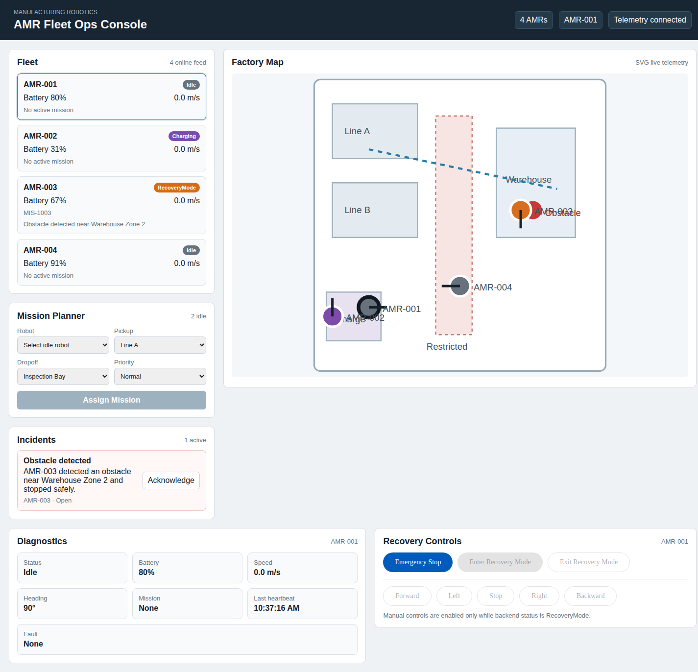
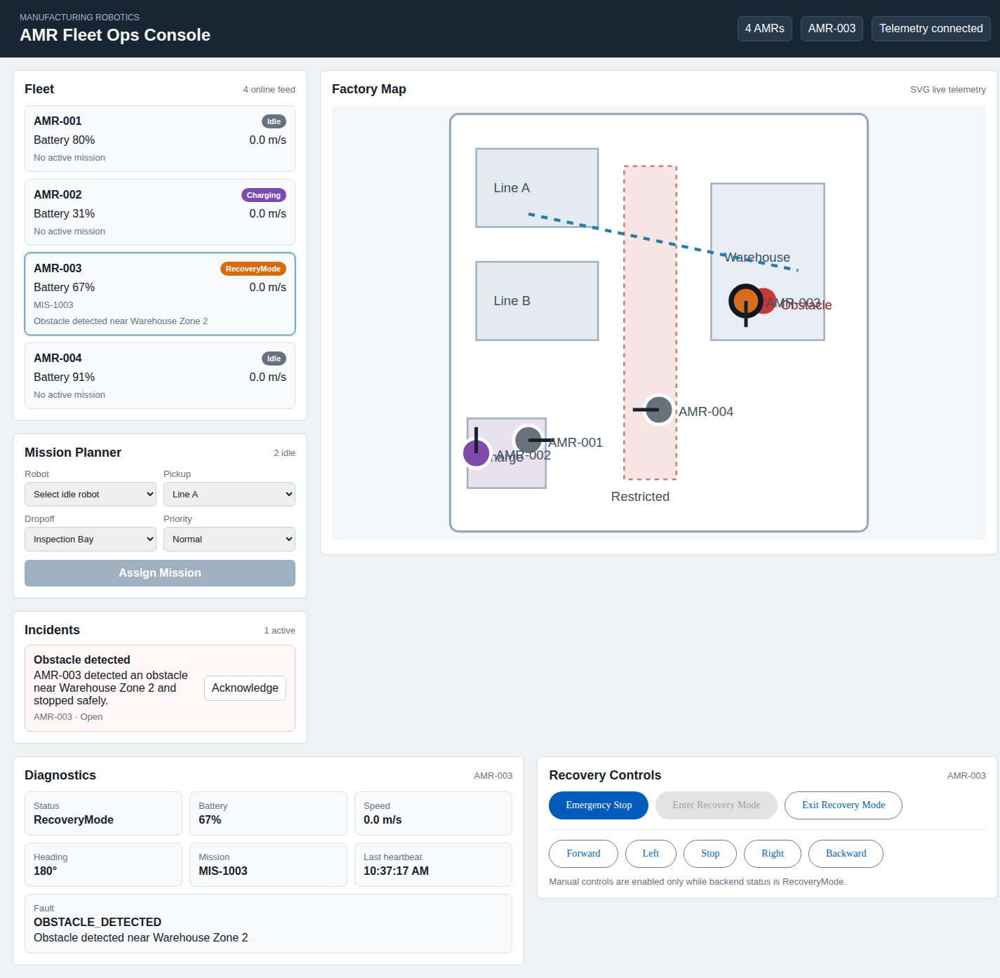

# AMR Fleet Ops Console

An operator-facing dashboard for a simulated Autonomous Mobile Robot fleet on a manufacturing floor.

## Why this project exists

This project demonstrates the operator-facing application layer for an AMR fleet management system in a manufacturing environment.

It focuses on real-time fleet visibility, map-based mission planning, diagnostics, incident handling, and recovery workflows with safety interlocks.

The robotics middleware is simulated, but the backend is structured so the simulator could be replaced by an adapter to ROS 2/DDS or a factory system.

## Features

- Angular dashboard with fleet cards, diagnostics, mission planning, incidents, and recovery controls
- ASP.NET Core API with in-memory robot, mission, and incident state
- SignalR telemetry stream that updates robot positions every second
- SVG factory map with AMR markers, zones, route hints, charging station, and obstacle marker
- AMR-003 blocked incident scenario with acknowledgement and recovery flow
- Backend-enforced tele-operation safety interlock
- Docker Compose local deployment

## Architecture

```text
+-----------------------+
| Angular Operator UI   |
+-----------+-----------+
            |
            | REST + SignalR
            |
+-----------v-----------+
| ASP.NET Core API      |
| Robot/Mission/Incident|
+-----------+-----------+
            |
            | Fleet store + simulator
            |
+-----------v-----------+
| In-memory telemetry   |
| ROS 2/DDS adapter later|
+-----------------------+
```

## Run locally

Start the backend:

```bash
dotnet run --project backend/AmrFleet.Api/AmrFleet.Api.csproj --urls http://localhost:5000
```

Start the frontend:

```bash
cd frontend/amr-fleet-ui
npm install
npm start
```

Open `http://localhost:4200`.

## Run with Docker

```bash
docker compose up --build
```

The API runs on `http://localhost:5000` and the UI runs on `http://localhost:4200`.

## Configuration

Runtime settings are in `backend/AmrFleet.Api/appsettings.json`:

- `FleetConsole:CorsOrigins` controls allowed UI origins.
- `FleetConsole:SimulatorTickMilliseconds` controls telemetry update frequency.
- `FleetConsole:MapMinimumCoordinate` and `MapMaximumCoordinate` control simulator bounds.
- `OperatorCommands:RequiredToken` protects emergency stop, recovery mode, and tele-op endpoints.

The local UI sends the demo token `demo-operator-token` through `X-Operator-Token`. Replace this demo boundary with real identity and role-based authorization before connecting to physical robots.

## Demo scenario

1. Open the dashboard and observe four AMRs.
2. Watch live SignalR telemetry move robots on the SVG map.
3. Assign a mission to AMR-004 while it is idle.
4. Open the AMR-003 obstacle incident and acknowledge it.
5. Select AMR-003 and enter Recovery Mode after confirmation.
6. Use manual Stop, Forward, Backward, Left, or Right commands.
7. Exit Recovery Mode and verify AMR-003 returns to Idle with the fault cleared.

## Screenshots

### Live Fleet Dashboard



### Blocked Robot Incident



### Recovery Mode Controls


## Production considerations

- Replace the simulator with a ROS 2/DDS or factory-system adapter behind the backend service boundary.
- Persist robot, mission, and incident state in a database or event stream.
- Replace the demo operator token with authentication, authorization, audit logs, and operator role checks before exposing recovery controls.
- Send logs, metrics, and SignalR connection health to an observability platform.
- Add deployment-specific CORS and TLS configuration.

## Future enhancements

- Historical mission replay
- Operator audit trail
- Factory zone permissions
- Fleet KPI trend charts
- Real robot middleware adapter
